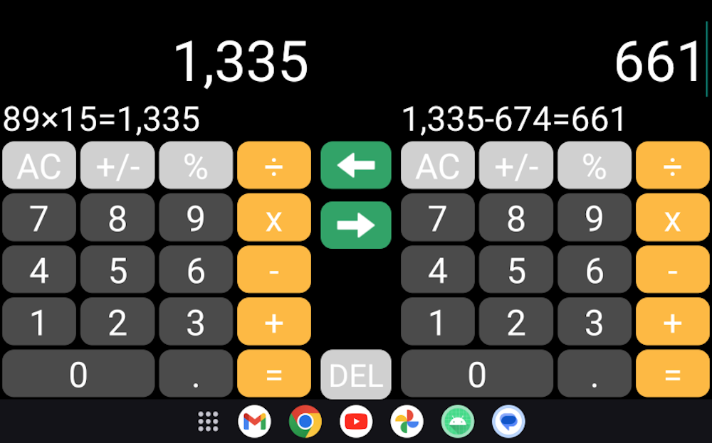

# WCalc
This simple clean calculator offers great user experience that you will love seeing. It supports dark and light mode background and you can copy the result or formula to clipboard by long pressing it.

The app is a simple helper for fast calculations with many basic functions including multiplying, dividing and percent. Every time clicking button, you can have vibration effect on button presses to make you confident. 

In landscape mode, you can have two calculators and let you can compare two numbers in some cases.

- In portrait mode, "AC" button will be "DEL" button, and you also can reset by long pressing.
- The calculation result on the calculator on the left can be moved to the one on the right by tapping the arrow key, enabling users to continue computations.
- For example, if a user calculates "89 x 15 = 1335" on one calculator and taps the arrow key, the result "1335" will be displayed on the other calculator, allowing the user to continue a problem while the previous equations are still shown on the screen. This makes it easy to notice errors.
- It is also possible to perform different computations on each calculator. This function comes in handy when the user wants to compare prices to determine which store product is cheaper by the gram, for example.
- Just one calculator is displayed on the smartphone's vertical screen mode, while two are shown only when the screen is rotated on its side.

Features:
- No unnecessary permissions.
- Copy value by long pressing.
- Clear calculation process.
- Portrait and landscape orientation
- Responsive layouts for mobile and tablet.
- Easy to use calculator.
- Support light and dark mode to allow smooth usage of calculator.

## Screenshots

